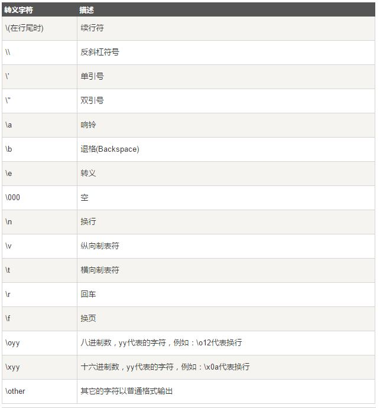
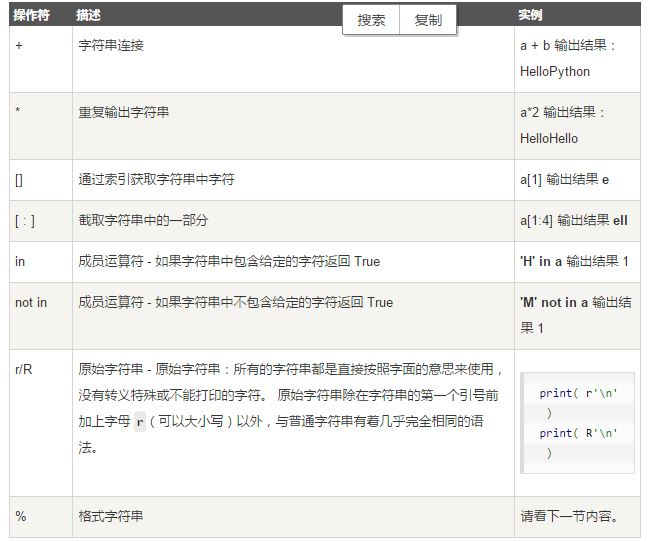
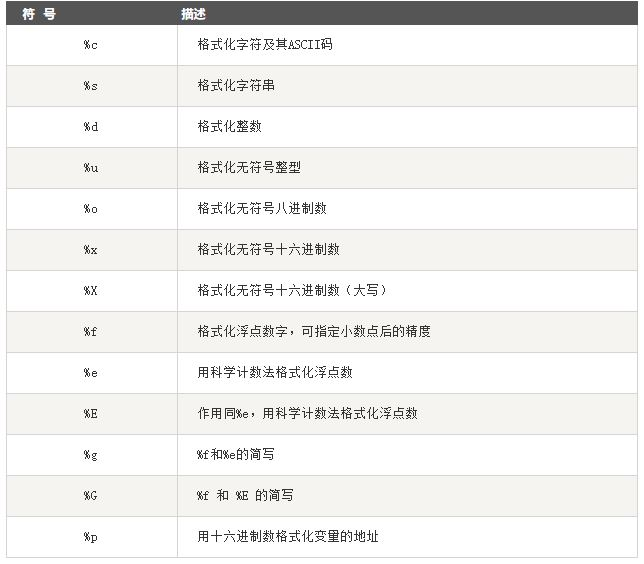
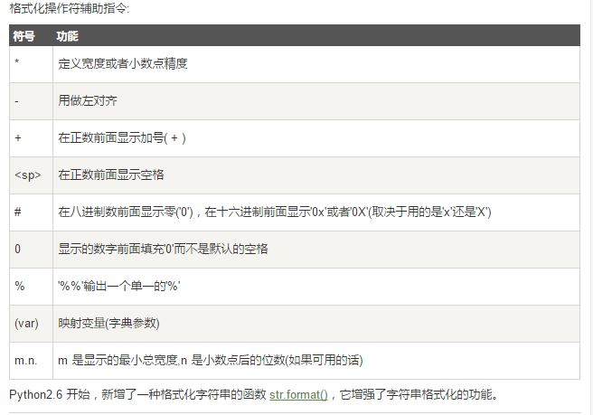

#Python3 字符串


+ 字符串是 Python 中最常用的数据类型。我们可以使用引号('或")来创建字符串。
创建字符串很简单，只要为变量分配一个值即可。<br/>

例如：`var1='hello，world'`

##1.  Python 访问字符串中的值

1. Python 不支持单字符类型，单字符也在Python也是作为一个字符串使用。
2. Python 访问子字符串，可以使用方括号来截取字符串.(这个在前面的学习中提到过。所以不提例子了。)


##2. Python字符串更新

你可以截取字符串的一部分并与其他字段拼接。

如下实例：

```
#!/usr/bin/python3
 
var1 = 'Hello World!'
 
print ("已更新字符串 : ", var1[:6] + 'Runoob!')

```
执行结果：`已更新字符串 :  Hello Runoob!`

##3. Python转义字符

在需要在字符中使用特殊字符时，python用反斜杠(\)转义字符。如下表：




##4. Python字符串运算符

下表实例变量a值为字符串 "Hello"，b变量值为 "Python"：



+ 个人觉得原始字符串比较好用，需要记一下。


###5. Python字符串格式化

Python 支持格式化字符串的输出 。尽管这样可能会用到非常复杂的表达式，但最基本的用法是将一个值插入到一个有字符串格式符 %s 的字符串中。<br/>
在 Python 中，字符串格式化使用与 C 中 sprintf 函数一样的语法。<br/>





###6. Python三引号

python三引号允许一个字符串跨多行，字符串中可以包含换行符、制表符以及其他特殊字符。实例如下：
```
#!/usr/bin/python3
 
para_str = """这是一个多行字符串的实例
多行字符串可以使用制表符
TAB ( \t )。
也可以使用换行符 [ \n ]。
"""
print (para_str)

```

执行结果：
```
这是一个多行字符串的实例
多行字符串可以使用制表符
TAB (    )。
也可以使用换行符 [ 
 ]。

```
+ 三引号让程序员从引号和特殊字符串的泥潭里面解脱出来，自始至终保持一小块字符串的格式是所谓的WYSIWYG（所见即所得）格式的。


###7. Unicode 字符串

+ 在Python2中，普通字符串是以8位ASCII码进行存储的，而Unicode字符串则存储为16位unicode字符串，这样能够表示更多的字符集。使用的语法是在字符串前面加上前缀 u。<br/>
在Python3中，所有的字符串都是Unicode字符串。

###8. Python 的字符串内建函数

这个例子太多，详见：

<a href="http://www.runoob.com/python3/python3-string.html"target="_blank">Python3_字符串</a>


练习题：

1. Python练习：17.22.23.30.33.60.62.70<br/>
2. Python3实例：List常用操作。

