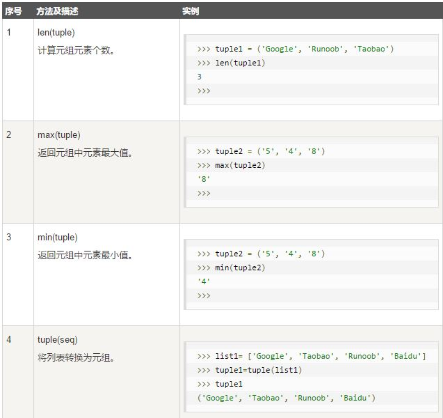

#  Python3 元组


- Python 的元组与列表类似，不同之处在于元组的元素不能修改。
- 元组使用小括号，列表使用方括号。
- 元组创建很简单，只需要在括号中添加元素，并使用逗号隔开即可。

如下实例：

``` 
tup1 = ('Google', 'Runoob', 1997, 2000);
tup2 = (1, 2, 3, 4, 5 );
tup3 = "a", "b", "c", "d";

```

创建空元组：`tup1 = ();`

- <strong>元组中只包含一个元素时，需要在元素后面添加逗号，否则括号会被当作运算符使用：</strong>

```
>>> tup1 = (50)
>>> type(tup1)     # 不加逗号，类型为整型
<class 'int'>

>>> tup1 = (50,)
>>> type(tup1)     # 加上逗号，类型为元组
<class 'tuple'>

```

##   1.访问元组

- 元组可以使用下标索引来访问元组中的值

##   2.修改元组

- 元组中的元素值是不允许修改的，但我们可以对元组进行连接组合.


##   3.删除元组

- 元组中的元素值是不允许删除的，但我们可以使用del语句来删除整个元组

```
#!/usr/bin/python3

tup = ('Google', 'Runoob', 1997, 2000)

print (tup)
del tup;
print ("删除后的元组 tup : ")
print (tup)

```


##  4.元组运算符,元组索引，截取


- 因为元组也是一个序列，所以我们可以访问元组中的指定位置的元素，也可以截取索引中的一段元素.


##  5.元组内置函数

Python元组包含了以下内置函数

