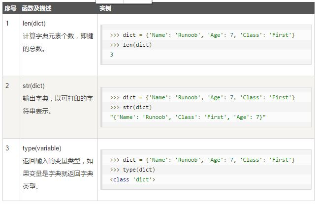
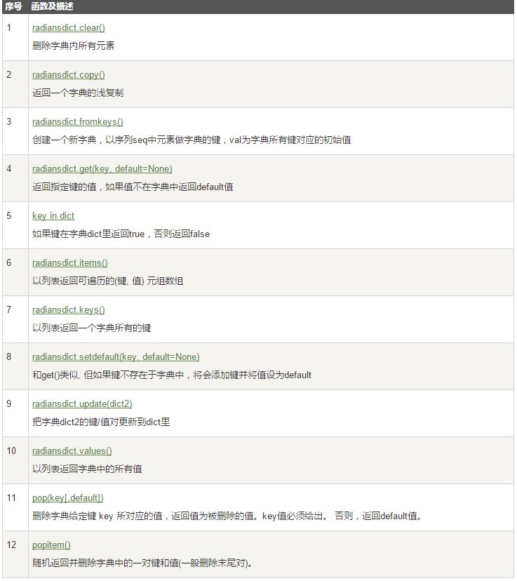

#   Python3 字典

- 字典是另一种可变容器模型，且可存储任意类型对象。<br/>

- 字典的每个键值(key=>value)对用冒号(:)分割，每个对之间用逗号(,)分割，整个字典包括在花括号({})中 ,格式如下所示：`d = {key1 : value1, key2 : value2 }`


##  1.访问字典里的值
- 把相应的键放入熟悉的方括弧，如下实例:

```
#!/usr/bin/python3

dict = {'Name': 'Runoob', 'Age': 7, 'Class': 'First'}

print ("dict['Name']: ", dict['Name'])
print ("dict['Age']: ", dict['Age'])

```

输出结果如下：

```
dict['Name']:  Runoob
dict['Age']:  7

```

##  2.修改字典

- 字典可以添加新的内容，也可以修改内容。

```
#!/usr/bin/python3

dict = {'Name': 'Runoob', 'Age': 7, 'Class': 'First'}

dict['Age'] = 8;               # 更新 Age
dict['School'] = "菜鸟教程"  # 添加信息


print ("dict['Age']: ", dict['Age'])
print ("dict['School']: ", dict['School'])

```

##  3.删除字典元素

- 能删单一的元素也能清空字典，清空只需一项操作。
- 显示删除一个字典用del命令，如下实例：

```
#!/usr/bin/python3

dict = {'Name': 'Runoob', 'Age': 7, 'Class': 'First'}

del dict['Name'] # 删除键 'Name'
dict.clear()     # 清空字典
del dict         # 删除字典

print ("dict['Age']: ", dict['Age'])
print ("dict['School']: ", dict['School'])

```

但这会引发一个异常，因为用执行 del 操作后字典不再存在：

```
Traceback (most recent call last):
  File "test.py", line 9, in <module>
    print ("dict['Age']: ", dict['Age'])
TypeError: 'type' object is not subscriptable

```

##  4.字典的特性
字典值可以是任何的 python 对象，既可以是标准的对象，也可以是用户定义的，但键不行。
两个重要的点需要记住：
1）不允许同一个键出现两次。创建时如果同一个键被赋值两次，后一个值会被记住（相当于被覆盖了）。
2）键必须不可变，所以可以用数字，字符串或元组充当，而用列表就不行，如下实例：

```
#!/usr/bin/python3

dict = {['Name']: 'Runoob', 'Age': 7}

print ("dict['Name']: ", dict['Name'])

```

输出结果

```
Traceback (most recent call last):
  File "test.py", line 3, in <module>
    dict = {['Name']: 'Runoob', 'Age': 7}
TypeError: unhashable type: 'list'

```

##  5.字典内置函数&方法







+ 另外比较有趣的一点，字典是支持无限极嵌套的，如下面代码：

```
cities={
    '北京':{
        '朝阳':['国贸','CBD','天阶','我爱我家','链接地产'],
        '海淀':['圆明园','苏州街','中关村','北京大学'],
        '昌平':['沙河','南口','小汤山',],
        '怀柔':['桃花','梅花','大山'],
        '密云':['密云A','密云B','密云C']
    },
    '河北':{
        '石家庄':['石家庄A','石家庄B','石家庄C','石家庄D','石家庄E'],
        '张家口':['张家口A','张家口B','张家口C'],
        '承德':['承德A','承德B','承德C','承德D']
    }
}

```

可以使用如下方法进行列出

```
for i in cities['北京']:
    print(i)

```

将列出如下结果：

```
朝阳
海淀
昌平
怀柔
密云

```

```
for i in cities['北京']['海淀']:
    print(i)

```


输出如下结果：

```
圆明园
苏州街
中关村
北京大学

```

+ 以上是借鉴了网友的笔记，个人觉得很有意思，所以copy过来，私自收藏了。:-)
   hackmeng
  715***8@qq.com

